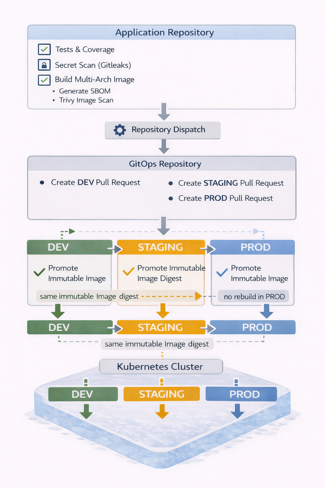
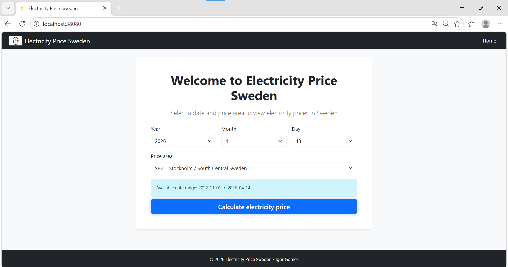
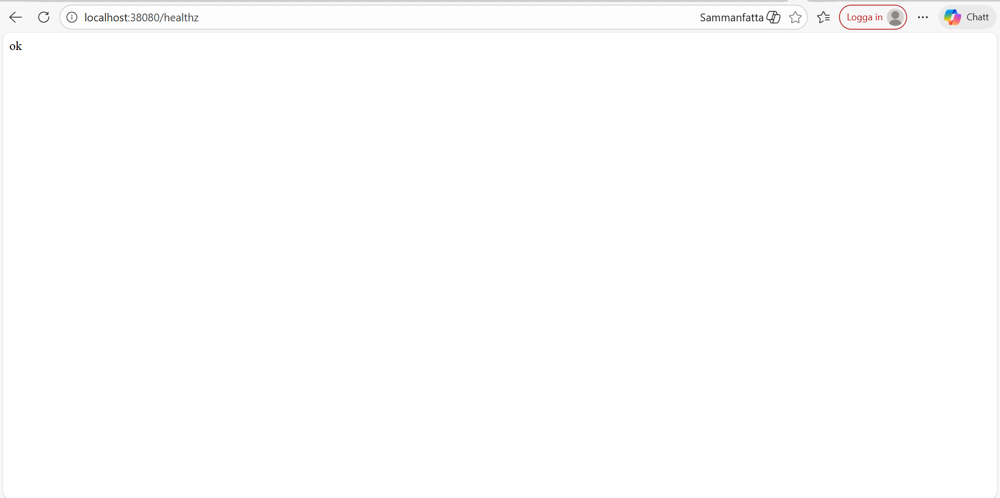

[](https://github.com/igor88gomes/electricity-price/tags)
[](https://github.com/igor88gomes/electricity-price/actions/workflows/ci.yaml)
[](https://github.com/igor88gomes/electricity-price/actions/workflows/ci.yaml)
[](https://github.com/igor88gomes/electricity-price/actions/workflows/secret-scan.yaml)
[](https://github.com/igor88gomes/electricity-price/actions/workflows/docker-publish.yaml)
[](https://github.com/igor88gomes/electricity-price/actions/workflows/promote-staging.yaml)
[](https://github.com/igor88gomes/electricity-price/actions/workflows/release-prod.yaml)
[](#)
[](https://github.com/users/igor88gomes/packages/container/package/electricity-price)


> Av Igor Gomes

# Electricity Price Sweden — Application Repository

> Detta repository ansvarar för applikationskod och innehåller pipelines som testar, bygger och publicerar en container image (build artifact) samt initierar ett flöde till ett separat GitOps-repository.

## Related repositories

**GitOps (deployment & environment promotion): https://github.com/igor88gomes/electricity-price-gitops

## End-to-end CI/CD och GitOps-arkitektur

<p align="center">
  
  <br>
  <em>Övergripande CI/CD-flöde från applikationsbuild till GitOps-styrd deployment.</em>
</p>

> **Obs (säkerhet):** Pipelines i repositoryt kör kontinuerliga säkerhetsskanningar (**Trivy**, **Gitleaks**). Upptäckta secrets blockeras automatiskt av **Gitleaks** och stoppar flödet. Sårbarheter i beroenden och container image kan tillfälligt förekomma, identifieras av **Trivy** och hanteras löpande genom planerade uppdateringar.
>
> **Underhåll:** Dependabot används för schemalagda och kontrollerade uppdateringar av Python-beroenden, GitHub Actions och Docker base image.
>
> **Container build:** Imagen byggs via Dockerfile (non-root, pinned base image digest och healthcheck) och används både lokalt och i CI/CD-flödet.

## Projektöversikt

### Vad
> Python-baserad Flask-webbapplikation som visar elpriser för olika delar av Sverige per datum  
> (tabell + diagram), baserat på extern realtids-API.

### Varför
> Byggd för att fungera som grund för ett tillförlitligt och produktionsnära leveransflöde.

### Värde
> Stateless design utan databas ger ett förutsägbart driftbeteende och underlättar horisontell
> skalning i Kubernetes. 

> Repositoryt visar ett leveransflöde med tester och coverage,
> säkerhetsskanning samt build av ett immutabelt container image som konsumeras av ett separat
> GitOps-repository för kontrollerad miljö-promotion.

### Avgränsningar
> Beroende av extern API och dess publiceringstider samt begränsat datumintervall.  
> Ingen caching (avsiktligt utanför scope).

## Datakälla

Applikationen hämtar elprisdata från **Elpriset just nu** (elprisetjustnu.se), exponerat via ett publikt API: https://www.elprisetjustnu.se/elpris-api

## Teknikstack

| Komponent         | Syfte / Roll                         |
|-------------------|--------------------------------------|
| Python            | Applikationsspråk                    |
| Flask             | Webbramverk (API & UI)               |
| Jinja2            | Template-rendering                   |
| HTML / Bootstrap  | UI (frontend)                        |
| Pandas            | Databehandling                       |
| Plotly            | Interaktiva diagram                  |
| pytest            | Enhetstestning                       |
| prometheus-client | Metrik och monitoring                |

## Dependency management

Projektet separerar runtime- och testberoenden i separata filer.

| Fil                     | Innehåll                               | Användning                 |
|-------------------------|----------------------------------------|----------------------------|
| `requirements.txt`      | Runtime-beroenden för applikationen    | Bygga container image      |
| `requirements-test.txt` | Test-, coverage- och CI-verktyg        | CI-pipeline och lokal test |
   
---

## Applikationsbeskrivning

Den Flask-baserade webbapplikationen låter användaren söka efter elpriser för olika delar av Sverige för ett valt datum. Applikationen visar timvisa elpriser (00:00–23:00). Data hämtas från en extern API, bearbetas med Pandas och presenteras i tabellform samt som interaktiva Plotly-diagram.

## Funktioner

- Formulär för att välja datum
- Hämtar elprisdata automatiskt via API
- Visar resultat i tabellformat
- Interaktiv diagram-visualisering
- Hälsokontroller: `/healthz` och `/readyz`
- Prometheus-metrik på `/metrics`
- Fullt enhetstestad med `pytest`

---

## Installation & Körning (lokalt)

### Klona projektet

```bash
git clone https://github.com/igor88gomes/electricity-price.git
cd electricity-price
```

### Förutsättningar för containerbaserad körning

Följande behöver vara installerat på systemet:

- **Docker** med **Docker Compose** *eller* **Podman** med **Podman Compose**

Instruktionerna nedan använder **Docker** som standard.  
Vid användning av **Podman**, ersätt:
- `docker` med `podman`
- `docker compose` med `podman-compose`

### Välj ett alternativ för att komma igång

### Alternativ A: Kör med Docker Compose (Python ingår i imagen)

#### 1️⃣ Bygg och starta applikationen med ett kommando

```bash
docker compose up --build -d 
```

#### 2️⃣ Öppna i webbläsaren:

- Applikationen: http://localhost:38080
- Health check: http://localhost:38080/healthz

<p align="center">
  
  <br>
  <em>Startvy för applikationen (localhost:38080)</em>
</p>

<p align="center">
  
  <br>
  <em>Health check-endpoint (/healthz)</em>
</p>

### Alternativ B: Kör applikationen lokalt med Python-virtuell miljö (Kräver Python 3.12+ installerat)

#### 1️⃣ Skapar lokal  miljö (katalogen .venv)

```bash
python -m venv .venv
```
 
#### 2️⃣ Aktivera miljön

> På macOS/Linux

```bash
source .venv/bin/activate  
```

> På Windows (PowerShell)

```bash
.\.venv\Scripts\Activate.ps1
```

> Tips: Om PowerShell klagar på skriptpolicy, kör: 
> Set-ExecutionPolicy -Scope CurrentUser RemoteSigned 

#### 3️⃣ Uppdatera pip och installera beroenden

```bash
python -m pip install --upgrade pip
python -m pip install -r requirements.txt
```

#### 4️⃣ Starta applikationen

```bash
python -m flask --app application.app run
```

#### 5️⃣ Öppna sedan i webbläsaren:  

http://localhost:5000

---

### Testning lokalt (virtuell miljö)

För att köra alla tester i terminalen:

#### 1️⃣ Uppdatera pip och installera testberoenden

```bash
python -m pip install --upgrade pip
python -m pip install -r requirements-test.txt
```

#### 2️⃣ Köra tester 

```bash
pytest -q
```

#### 3️⃣ Kör tester med coverage (samma mätning som i CI)

```bash
pytest -q --cov=application --cov-report=term
```

---

## Viktiga endpoints

| Endpoint     | Funktion                             |
|--------------|--------------------------------------|
| `/`          | Startvy med formulär                 |
| `/calculate` | Beräknar och visar elprisdata        |
| `/healthz`   | Liveness-check                       |
| `/readyz`    | Readiness-check                      |
| `/metrics`   | Prometheus-metrik                    |

Exempel på åtkomst:

http://localhost:38080/metrics

> **Obs:** Endpointen `/calculate` används via formuläret i webbgränssnittet och är inte avsedd att anropas direkt i webbläsaren (HTTP POST).

## CI/CD-pipelines (Build → PR till GitOps → Deployment)

Build, säkerhetskontroller och publicering av container image till GitHub Container Registry (GHCR) sker via application-repositoryts pipelines, medan deployment och miljö-promotion verkställs via ett separat GitOps-repository.

Promotioner initieras från application-repositoryt via `repository_dispatch`, per workflow för respektive miljö, vilket triggar workflows i GitOps-repositoryt som skapar Pull Requests som i sin tur triggar synk och deployment i respektive miljö (DEV, STAGING, PROD).

### Workflows i Application Repository

- **Secret Scan** – secret scanning med Gitleaks
- **CI** – lint, format-kontroll, tester och coverage
- **CD – DEV** – build och publicering av immutable multi-arch image (DEV) till GHCR, inklusive SBOM och Trivy scan
- **Promote STAGING** – promotion av samma image digest från DEV
- **Release PROD** – promotion av samma image digest till PROD utan rebuild

---

## Projektstruktur

```text
electricity-price/
├── .github/workflows/      # CI/CD-workflows (CI, Docker publish, secret-scan, promote-staging, release-prod)
├── application/            # Flask-applikation: routes, logik, templates och statiska filer
├── docs/                   # Dokumentation (t.ex. skärmdumpar, extra beskrivningar)
├── tests/                  # Pytest-tester för applikationen
├── .dockerignore           # Utesluter onödiga filer från Docker build-context
├── .gitignore              # Ignorerade filer (virtuell miljö, cache, rapporter, etc.)
├── .gitleaks.toml          # Regler för secret scanning (Gitleaks)
├── .ruff.toml              # Konfiguration för Ruff (lint och format)
├── docker-compose.yaml     # Lokal körning med Docker Compose
├── Dockerfile              # Bygger Docker-image för Flask-applikationen
├── pytest.ini              # Pytest-konfiguration (plugins, options)
├── requirements.txt        # Runtime-beroenden för applikationen
├── requirements-test.txt   # Test- och CI-beroenden
└── README.md               # Projektöversikt, användning och arkitektur
```

---

## Kontakt

Igor Gomes — DevOps Engineer  
**E-post:** [igor88gomes@gmail.com](mailto:igor88gomes@gmail.com)  
**LinkedIn:** [linkedin.com/in/igor-gomes-5b6184290](https://www.linkedin.com/in/igor-gomes-5b6184290)