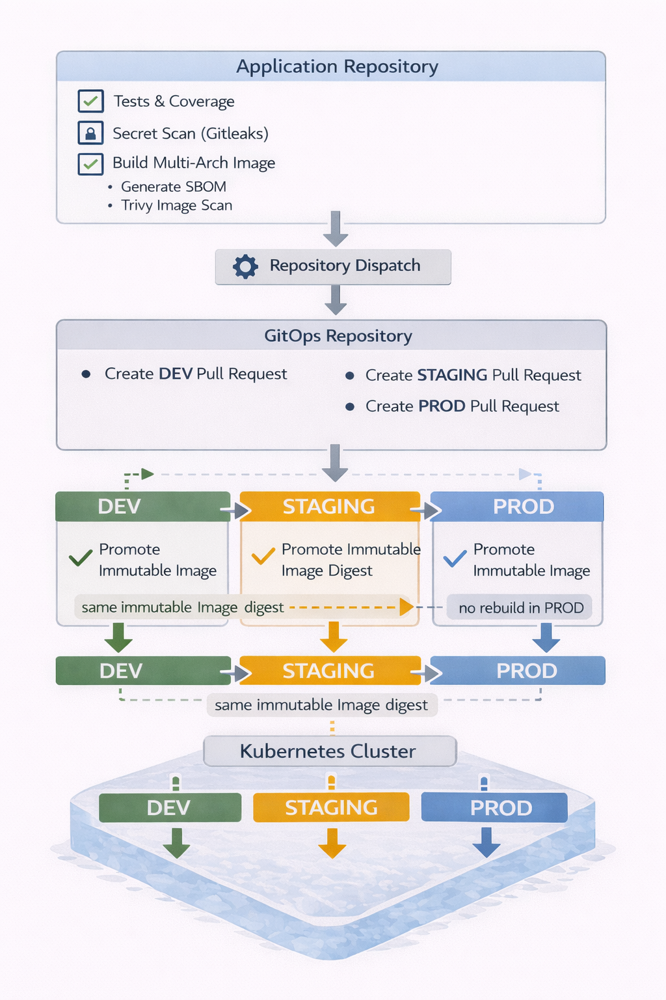
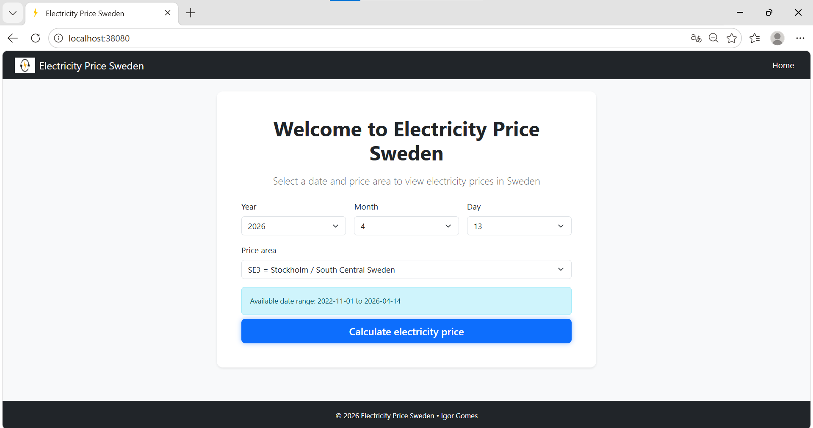
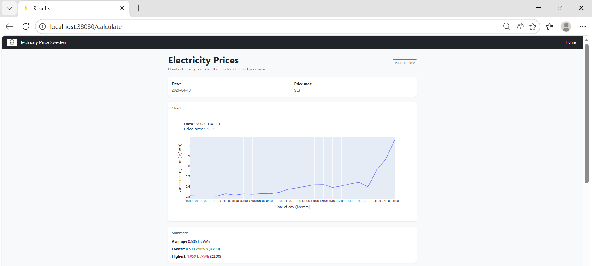
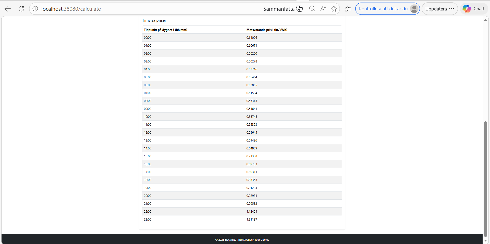

[](https://github.com/igor88gomes/electricity-price/tags)
[](https://github.com/igor88gomes/electricity-price/actions/workflows/ci.yaml)
[](https://github.com/igor88gomes/electricity-price/actions/workflows/ci.yaml)
[](https://github.com/igor88gomes/electricity-price/actions/workflows/secret-scan.yaml)
[](https://github.com/igor88gomes/electricity-price/actions/workflows/docker-publish.yaml)
[](https://github.com/igor88gomes/electricity-price/actions/workflows/promote-staging.yaml)
[](https://github.com/igor88gomes/electricity-price/actions/workflows/release-prod.yaml)
[](#)
[](https://github.com/users/igor88gomes/packages/container/package/electricity-price)


🇸🇪 Swedish version:
👉 [Read in Swedish](README.sv.md)

---

> By Igor Gomes

# Electricity Price Sweden — Application Repository

A DevOps-focused project demonstrating a complete delivery workflow, including CI/CD, GitOps, integrated security practices, observability, policy enforcement and controlled environment promotion, built around a self-developed application.

## Overview

### This repository is responsible for
- application code
- tests, lint and coverage
- security scanning
- build and publishing of the container image (artifact)
- triggering deployment to a GitOps repository

### Separate GitOps repository is responsible for
- deployment and environment promotion (DEV → STAGING → PROD)
- runtime configuration and Helm-based deployment
- validation, security and policy enforcement (GitHub Actions + OPA)
- observability, dashboards and alerting in Kubernetes
- rollback through declarative GitOps

> Together, they demonstrate a complete flow from application code to deployment using GitOps in a Kubernetes cluster.

## Related Repository

**GitOps (deployment & environment promotion):** [electricity-price-gitops](https://github.com/igor88gomes/electricity-price-gitops)

## End-to-end CI/CD and GitOps Architecture

<p align="center">
  
  <br>
  <em>High-level CI/CD flow from application build to GitOps-driven deployment.</em>
</p>

> **Note (security):** The pipelines in this repository run continuous security scans (**Trivy**, **Gitleaks**). Detected secrets are automatically blocked by **Gitleaks**, stopping the pipeline. Vulnerabilities in dependencies and the container image may temporarily occur, are identified by **Trivy**, and are handled continuously through planned updates.
>
> **Maintenance:** Dependabot is used for scheduled and controlled updates of Python dependencies, GitHub Actions and the Docker base image.
>
> **Container build:** The image is built via a Dockerfile (non-root, pinned base image digest and healthcheck) and is used both locally and in the CI/CD pipeline.

## Project Overview

### What
> Python-based Flask web application that displays electricity prices for different regions in Sweden by date  
> (table + charts), based on an external real-time API.

### Why
> Built to serve as a foundation for a reliable and production-like delivery pipeline.

### Value
> A stateless design without a database provides predictable runtime behavior and enables horizontal scaling in Kubernetes. 

> The project demonstrates a complete delivery pipeline with testing, coverage and security scanning,
> where an immutable container artifact is built and used in a separate GitOps repository
> for controlled environment promotion.

### Limitations
> Depends on an external API and its publishing schedule, with a limited date range.  
> No caching (intentionally out of scope).

## Data Source

**Electricity price data (public API):** [Elpriset just nu – elpris-api](https://www.elprisetjustnu.se/elpris-api)

## Tech Stack

| Component         | Purpose / Role                         |
|-------------------|----------------------------------------|
| Python            | Application language                   |
| Flask             | Web framework (API & UI)               |
| Jinja2            | Template rendering                     |
| HTML / Bootstrap  | UI (frontend)                          |
| Pandas            | Data processing                        |
| Plotly            | Interactive charts                     |
| pytest            | Unit testing                           |
| prometheus-client | Metrics and monitoring                 |

## Dependency Management

The project separates runtime and test dependencies into different files.

| File                    | Content                                | Usage                      |
|-------------------------|----------------------------------------|----------------------------|
| `requirements.txt`      | Runtime dependencies for the application | Build container image      |
| `requirements-test.txt` | Test, coverage and CI tools            | CI pipeline and local testing |

---

## Application Description

The Flask-based web application allows users to search for electricity prices for different regions in Sweden for a selected date. The application displays hourly electricity prices (00:00–23:00). Data is retrieved from an external API, processed with Pandas, and presented in both table format and interactive Plotly charts.

## Features

- Form to select date  
- Automatically fetches electricity price data via API  
- Displays results in table format  
- Interactive chart visualization  
- Health checks: `/healthz` and `/readyz`  
- Prometheus metrics available at `/metrics`  
- Fully unit tested with `pytest`  

---

## Installation & Run (local)

### 1️⃣ Clone the project

```bash
git clone https://github.com/igor88gomes/electricity-price.git
cd electricity-price
```

### 2️⃣ Start the application (Docker)

```bash
docker compose up -d
```

> This uses a published and verified release image of the application, pulled directly from GHCR.

### 3️⃣ Open in the browser

- Application: `http://localhost:38080`

<p align="center">
  
  <br>
  <em>Form to select date and region for electricity price calculation.</em>
</p>

### 4️⃣ Data processing and visualization

- The result view is shown after the form has been submitted

<p align="center">
  
  <br>
  <em>Processed electricity price data visualized with Plotly together with a result summary.</em>
</p>

<p align="center">
  
  <br>
  <em>Hourly electricity prices presented in table format (Pandas).</em>
</p>

---

## Key Endpoints

| Endpoint     | Function                              |
|--------------|----------------------------------------|
| `/`          | Home view with form                   |
| `/calculate` | Calculates and displays electricity data |
| `/healthz`   | Liveness check                        |
| `/readyz`    | Readiness check                       |
| `/metrics`   | Prometheus metrics                    |

> **Note:** The `/calculate` endpoint is used via the web interface form and is not intended to be accessed directly in the browser (HTTP POST).

## CI/CD Pipelines (Build → PR to GitOps → Deployment)

Build, security checks, and publishing of the container image to GitHub Container Registry (GHCR) are handled by the application repository pipelines, while deployment and environment promotion are executed via a separate GitOps repository.

Promotions are initiated from the application repository using `repository_dispatch`. Each environment has a dedicated workflow, and promotion is orchestrated step-by-step:

- DEV is updated directly after a successful build.
- STAGING promotion is triggered via a dedicated workflow in the application repository.
- PROD is promoted via a tagged release workflow.

These workflows trigger events in the GitOps repository, where Pull Requests are created. Once merged, Argo CD synchronizes the desired state and deploys to each environment (DEV, STAGING, PROD).

### Workflows in Application Repository

> Promotion across environments reuses the same immutable image digest built once in DEV.

#### **Secret Scan (`secret-scan.yaml`)** 
– secret scanning with Gitleaks  

#### **CI (`ci.yaml`)** 
– linting, formatting checks, tests and coverage  

#### **CD – DEV (`docker-publish.yaml`)**
  - Build and publish immutable multi-arch image to GHCR  
  - Generate SBOM and run Trivy security scans  
  - Dispatch `update-dev` event to GitOps  
  - ➝ In the GitOps repository: a Pull Request is created and auto-merged in DEV  
  - Triggers the next step in the promotion flow (STAGING workflow in the application repo)  

#### **Promote STAGING (`promote-staging.yaml`)**
  - Dedicated workflow for STAGING promotion  
  - Resolves or receives the image digest from DEV  
  - Dispatches `promote-staging` event to GitOps  
  - ➝ In the GitOps repository: a Pull Request is created for manual review in STAGING  

#### **Release PROD (`release-prod.yaml`)**
  - Triggered manually via SemVer tag (`vX.Y.Z`)  
  - Promotes the same immutable image digest used in DEV and STAGING to PROD  
  - Dispatches `release-prod` event to GitOps  
  - ➝ In the GitOps repository: a Pull Request is created for manual review before deployment  

---

## Project Structure

```
electricity-price/
├── .github/workflows/      # CI/CD workflows (CI, Docker publish, secret-scan, promote-staging, release-prod)
├── application/            # Flask application: routes, logic, templates and static files
├── docs/                   # Documentation (e.g. screenshots, additional descriptions)
├── tests/                  # Pytest tests for the application
├── .dockerignore           # Excludes unnecessary files from Docker build context
├── .gitignore              # Ignored files (virtual environment, cache, reports, etc.)
├── .gitleaks.toml          # Rules for secret scanning (Gitleaks)
├── .ruff.toml              # Configuration for Ruff (lint and format)
├── docker-compose.yaml     # Local execution with Docker Compose
├── Dockerfile              # Builds Docker image for the Flask application
├── pytest.ini              # Pytest configuration (plugins, options)
├── requirements.txt        # Runtime dependencies for the application
├── requirements-test.txt   # Test and CI dependencies
├── README.md               # Project overview, usage and architecture (English)
└── README.sv.md            # Project overview, usage and architecture (Swedish)
```
---

## Contact

Igor Gomes — DevOps Engineer  
**Email:** [igor88gomes@gmail.com](mailto:igor88gomes@gmail.com)  
**LinkedIn:** [Igor Gomes](https://www.linkedin.com/in/igor-gomes-5b6184290)